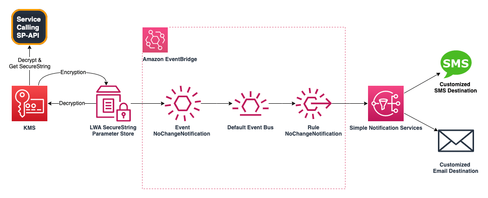

## Rotate your SP-API Credentials Securely and timely

To reduce the risk of exposed and compromised credentials, starting from February 6th, 2023, the SP-API Services require all developers to rotate their “Login With Amazon” (LWA) credentials every 180 days. If the LWA credentials are not updated before the expiration target date, the API integration will lose access to the SP-API. This blog will introduce a secure way to utilize Amazon AWS Systems Manager Parameter Store, KMS, EventBridge, and SNS to rotate SP-API credentials in a timely manner.



### Solution Overview

This solution includes the following components and services to help the developer separate their credentials and their code, as well as providing notification services that send rotation reminders through SMS and email to the AdminOps Team:

- AWS Lambda Function along with the access token exchanger code samples, representing the Developer Services calling the SP-API and LWA endpoint.
- AWS KMS symmetric key for encrypting and decrypting the LWA credentials.
- AWS System Manager Parameter Store for vaulting the LWA SecureString.
- AWS EventBridge for capturing scheduling and routing the LWA credential rotation notifications.
- AWS SNS for sending notifications to the SMS and email destination from the Ops Team as a rotation reminder.

### 1. Using System Manager Parameter Store to keep your LWA Credential 

Firstly, we will introduce how to use System Manager Parameter Store to store the LWA credentials centrally with encryption using Key Management Services. AWS System Manager Parameter Store provides a secure way to store the encrypted parameters by separating the data from the code. Here we take the LWA Client identifier as an example, using System Manager Parameter Store with [PutParameter](https://docs.aws.amazon.com/systems-manager/latest/userguide/parameter-store-policies.html) to create a SecureString using KMS default AES-256-GCM Symmetric algorithm to encrypt the credentials. We can use the following request body to create the parameter store for the client identifier. We can use a similar way to put parameters respectively with client secret and RefreshToken, which will be later used in the Lambda function.

```JSON
{
    "Name": "/my-erp/lwa/clientidentifier",
    "Description": "SecureString with LWA ClientIdentifier",
    "Value": "amzn1.application-oa2-client.my-application-id",
    "Type": "SecureString",
    "KeyId": "my-key-id-my-key-id",
    "Overwrite": "True",
    "Policies": [
        {
            "Type": "NoChangeNotification",
            "Version": "1.0",
            "Attributes": {
                "After": "150",
                "Unit": "Days"
            }
        }
    ]
}
```

### 2. Create a Lambda using the SecureString to Call SP-API

We will then create a Lambda function that makes an API call to the AWS System Manager services to get the plaintext of the LWA Client ID and Client Secret. To grant the required permissions for KMS and System Manager, we modified the default IAM Policy for the Lambda Role as the Policy below.

```json
{
    "Version": "2012-10-17",
    "Statement": [
        {
            "Effect": "Allow",
            "Action": [
                "ssm:GetParameters"
            ],
            "Resource": [
                "arn:aws:ssm:us-east-2:12DigitAWSID:parameter/my-erp*"
            ]
        },
        {
            "Effect": "Allow",
            "Action": [
                "kms:Decrypt"
            ],
            "Resource": [
                "arn:aws:kms:us-east-2:12DigitAWSID:key/5adcc01c-762c-4906-92fa-b679b4d68890"
            ]
        },
        {
            "Effect": "Allow",
            "Action": "logs:CreateLogGroup",
            "Resource": "arn:aws:logs:us-east-2:12DigitAWSID:*"
        },
        {
            "Effect": "Allow",
            "Action": [
                "logs:CreateLogStream",
                "logs:PutLogEvents"
            ],
            "Resource": [
                "arn:aws:logs:us-east-2:12DigitAWSID:log-group:/aws/lambda/my-lwa:*"
            ]
        }
    ]
}
```

The Lambda function represents the Backend service component which will render the true plant text of the LWA credential in the code and make the API call with Login with Amazon services. Using this way, combing the system manager and KMS, we could separate the code and the code config in different place. Then render the real config value in to the code in the runtime of the Lambda function.

```python
response = ssm.get_parameters(
    Names=['/my-erp/lwa/cliensecret', "/my-erp/lwa/clientidentifier", "/my-erp/refreshToken"], WithDecryption=True
)
client_id = response['Parameters'][1]["Value"],
clien_secret = response['Parameters'][0]["Value"],
refreshtoken = response['Parameters'][2]["Value"],
```

Run the folllowing command to create a Lambda Funtion .zip  file, and upload the zip file to the AWS Lambda function to deploy it.

```bash
 cd lambda-lwa 
 pip3 install -r requirements.txt -t .
 zip -r lwa-lambda-exchanger.zip .
```

### 3. Create a SNS Topic with Email SMS Subscription 

To make use of SNS notification service, firstly we need to create a SNS topic which will be used to notify the admin team to rotate the LWA credentials. We could use the following CLI command to create an SNS topic:

```bash
aws sns create-topic --name lwa-credential-rotation 
aws sns subscribe --topic-arn arn:aws:sns:us-east-2:12DigitAWSID:lwa-credential-rotation --protocol email --notification-endpoint user@example.com 
aws sns subscribe --topic-arn arn:aws:sns:us-east-2:12DigitAWSID:lwa-credential-rotation --protocol sms --notification-endpoint +1XXX5550100 
```

### 4. Add EventBridge Rules to Route Message to SNS 

To route the rotation reminder to the SNS topic we just created, we will add an EventBridge rule that will trigger an SNS notification on the specified schedule. We could use the following CloudFormation template to create the EventBridge rule:

```yaml
AWSTemplateFormatVersion: '2010-09-09'
Description: CloudFormation template for EventBridge rule 'ssm-parameter-store'
Resources:
  EventRule0:
    Type: AWS::Events::Rule
    Properties:
      EventBusName: default
      EventPattern:
        source:
          - aws.ssm
        detail-type:
          - Parameter Store Policy Action
        detail:
          parameter-name:
            - /my-erp/*
      Name: My-ERP-Rotate
      State: ENABLED
      Targets:
        - Id: my-sns-target-to-multi-email-and-sms
          Arn: >-
            arn:aws:sns:us-east-2:12DigitAWSID:lwa-credential-rotation
```

### 5. Rotate the LWA Credential in System Manager in the future


### Conclusion

With this solution, we can securely store the LWA credentials using AWS KMS and System Manager Parameter Store, separate the code and configuration, and automate the credential rotation process using EventBridge and SNS. By regularly rotating the LWA credentials, we can reduce the risk of credential exposure and compromise. The full code could be found in the GitHub Repo [SP-API-LWA-Rotation](https://github.com/aws-samples/sp-api-lwa-rotation).
