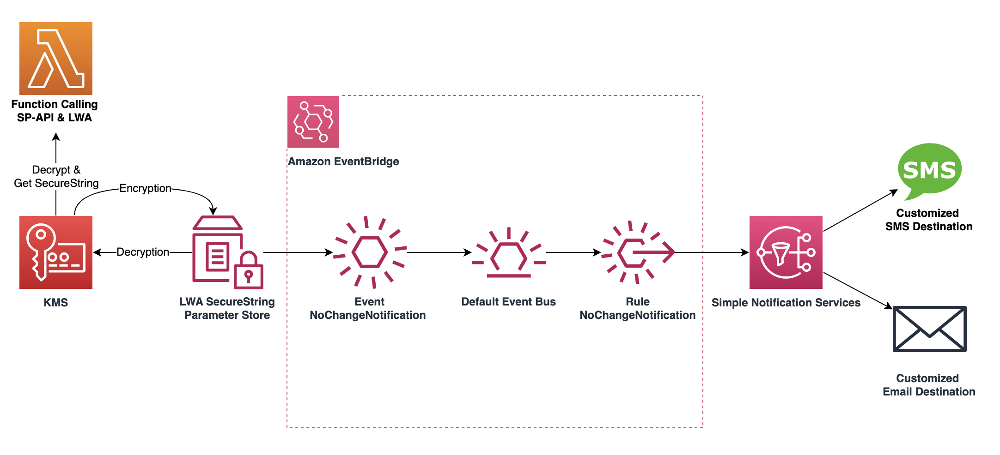

## Solution Overview

This solution includes the following components and services to help the developer separate their credentials and their code, as well as providing notification services that send rotation reminders through SMS and email to the IT Admin Team:

- AWS Lambda Function along with the access token exchanger code samples, representing the Developer Services calling the SP-API and LWA endpoint.
- AWS KMS symmetric key for encrypting and decrypting the LWA credentials.
- AWS System Manager Parameter Store for vaulting the LWA SecureString.
- AWS EventBridge for capturing scheduling and routing the LWA credential rotation notifications.
- AWS SNS for sending notifications to the SMS and email destination from the IT Admin Team as a rotation reminder.



### 1. Using System Manager Parameter Store to keep your LWA Credential 

Firstly, we will introduce how to use System Manager Parameter Store to store the LWA credentials centrally with encryption using Key Management Services. AWS System Manager Parameter Store provides a secure way to store the encrypted parameters by separating the data from the code. Here we take the LWA Client identifier as an example, using System Manager Parameter Store with [PutParameter](https://docs.aws.amazon.com/systems-manager/latest/userguide/parameter-store-policies.html) to create a SecureString using KMS default AES-256-GCM Symmetric algorithm to encrypt the credentials. We can use the following request body to create the parameter store for the client identifier. We can use a similar way to put parameters respectively with client secret and RefreshToken, which will be later used in the Lambda function.

```JSON
{
    "Name": "/my-erp/lwa/clientidentifier",
    "Description": "SecureString with LWA ClientIdentifier",
    "Value": "amzn1.application-oa2-client.my-application-id",
    "Type": "SecureString",
    "KeyId": "my-key-id-my-key-id",
    "Overwrite": "True",
    "Policies": [
        {
            "Type": "NoChangeNotification",
            "Version": "1.0",
            "Attributes": {
                "After": "150",
                "Unit": "Days"
            }
        }
    ]
}
```

### 2. Create a Lambda using the SecureString to Call SP-API

As the next step, we create a Lambda function to make an API call to the AWS System Manager services getting the plain text of the SP-API LWA Client ID and Client Secret. To grant the required permissions for KMS and System Manager, we use the IAM Policy below for the Lambda Role.

```json
{
    "Version": "2012-10-17",
    "Statement": [
        {
            "Effect": "Allow",
            "Action": [
                "ssm:GetParameters"
            ],
            "Resource": [
                "arn:aws:ssm:us-east-2:12DigitAWSID:parameter/my-erp*"
            ]
        },
        {
            "Effect": "Allow",
            "Action": [
                "kms:Decrypt"
            ],
            "Resource": [
                "arn:aws:kms:us-east-2:12DigitAWSID:key/5adcc01c-762c-4906-92fa-b679b4d68890"
            ]
        },
        {
            "Effect": "Allow",
            "Action": "logs:CreateLogGroup",
            "Resource": "arn:aws:logs:us-east-2:12DigitAWSID:*"
        },
        {
            "Effect": "Allow",
            "Action": [
                "logs:CreateLogStream",
                "logs:PutLogEvents"
            ],
            "Resource": [
                "arn:aws:logs:us-east-2:12DigitAWSID:log-group:/aws/lambda/my-lwa:*"
            ]
        }
    ]
}
```

Here we use the Lambda function to represent the backend service component which renders the true plain text of the LWA credential in the code and make the API call with Login with Amazon services and SP-API endpoint. Using this method, combining Systems Manager and KMS, we are able to separate the code and the code config in different places, then render the real config value into the code in the runtime of the Lambda function.

```python
def get_parameters():
    response = ssm.get_parameters(
        Names=['/my-erp/lwa/cliensecret', "/my-erp/lwa/clientidentifier", "/my-erp/refreshToken"], WithDecryption=True
    )

    payload = {'grant_type': 'refresh_token',
               'client_secret': response['Parameters'][0]["Value"],
               'client_id': response['Parameters'][1]["Value"],
               'refresh_token': response['Parameters'][2]["Value"]}
    lwa = requests.post("https://api.amazon.com/auth/o2/token", data=payload)

    return lwa.text


def lambda_handler(event, context):
    value = get_parameters()
    print("lwa value =  " + value)
    return value  # Echo back the first key value
```

Run the following command in the project folders to create a Lambda Function .zip file, and upload the zip file to the AWS Lambda function to deploy it.

```bash
 cd lambda-lwa 
 pip3 install -r requirements.txt -t .
 zip -r lwa-lambda-exchanger.zip .
```

### 3. Create a SNS Topic with Email SMS Subscription 

We will use the SNS topic to alert the IT admin team regarding the LWA credential rotation, and use the SNS subscription destinations through Email and SMS to receive these notifications. The below CLI command can create both the SNS topic and its corresponding subscriptions.

```bash
aws sns create-topic --name lwa-credential-rotation 
aws sns subscribe --topic-arn arn:aws:sns:us-east-2:12DigitAWSID:lwa-credential-rotation --protocol email --notification-endpoint user@example.com 
aws sns subscribe --topic-arn arn:aws:sns:us-east-2:12DigitAWSID:lwa-credential-rotation --protocol sms --notification-endpoint +1XXX5550100 
```

### 4. Add EventBridge Rules to Route Message to SNS 

To route the rotation reminder to the SNS topic we just created, we will add an EventBridge rule that will trigger an SNS notification on the specified schedule. We could use the following CloudFormation template to create the EventBridge rule:

```yaml
AWSTemplateFormatVersion: '2010-09-09'
Description: CloudFormation template for EventBridge rule 'ssm-parameter-store'
Resources:
  EventRule0:
    Type: AWS::Events::Rule
    Properties:
      EventBusName: default
      EventPattern:
        source:
          - aws.ssm
        detail-type:
          - Parameter Store Policy Action
        detail:
          parameter-name:
            - /my-erp/*
      Name: My-ERP-Rotate
      State: ENABLED
      Targets:
        - Id: my-sns-target-to-multi-email-and-sms
          Arn: >-
            arn:aws:sns:us-east-2:12DigitAWSID:lwa-credential-rotation
```

After creating the above components, for each rotation due, the SSM Parameter store will send a rotation event that EventBridge will route to your SNS email and SMS subscription.  A sample email message looks below.


### 5. Rotate the LWA Credential in System Manager in the future

To securely update the credentials, we can log into the seller central with the developer account, navigate to the Developer Console page and generate the new SP-API LWA credentials.


The existing credentials will expire after the new credentials are generated after 7 days. With central parameter store being used to store the LWA credentials, we can update the Secure String in the SSM service with the newly generated credentials., which will automatically be effective every time the code is triggered.


### Conclusion

With this solution, we can securely store the LWA credentials using AWS KMS and System Manager Parameter Store, separate the code and configuration, and automate the credential rotation process using EventBridge and SNS. By regularly rotating the LWA credentials, we can reduce the risk of credential exposure and compromise.
